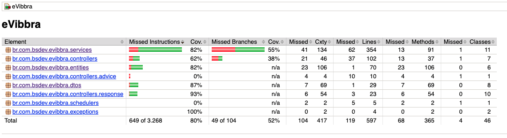
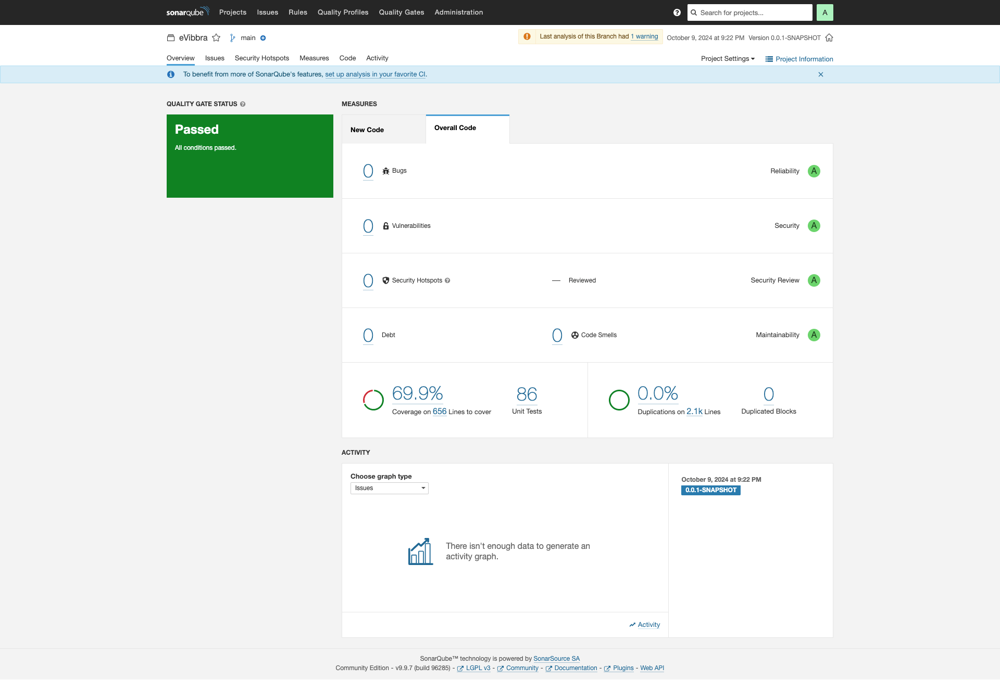

# eVibbra-API

The **eVibbra-API** is a backend system designed to simplify the financial management of individual microentrepreneurs (MEIs). The system allows users to manage their revenue, expenses, notifications, and more through a modular architecture, either as a well-structured monolith or through microservices for scalability. The system aims to provide a seamless user experience with features such as secure authentication, expense tracking, and revenue reporting, while ensuring maintainability and scalability through best practices.

## Table of Contents

- [Architecture](#architecture)
- [Technologies](#technologies)
- [Features](#features)
- [Project Structure](#project-structure)
- [Endpoints](#endpoints)
- [Database Design](#database-design)
- [Getting Started](#getting-started)
- [Testing](#testing)
- [Security](#security)

## Architecture

The **eVibbra-API** is built following a modular approach that can evolve into microservices as the system grows. The key services/modules envisioned for this system are:

- **Billing Service**: Manages invoices (fiscal notes) and revenues.
- **Expense Service**: Tracks and manages expenses.
- **User Service**: Handles user authentication, preferences, and profiles.
- **Notification Service**: Sends alerts via email and SMS.

For simplicity in the initial phase, the services are modularized within a monolithic architecture using **Spring Boot**, with a potential future evolution to microservices based on system demands.

## Technologies

- **Backend Framework**: Spring Boot (Java)
- **Database**: PostgreSQL (Relational Database)
- **Authentication**: JWT (JSON Web Tokens)
- **Notification Integration**: MailerSend & Textbelt
- **CI/CD**: GitLab CI
- **Testing**: JUnit for unit testing, Mockito for mocking

## Features

- **User Authentication**: Secure login and user registration via JWT.
- **Expense and Revenue Management**: Track invoices and expenses for effective financial management.
- **Notifications**: Users can receive reminders and alerts about billing and expenses.
- **User Preferences**: Manage user-specific settings, including expense limits and notification preferences.

## Project Structure

| Directory      | Description                                      |
|----------------|--------------------------------------------------|
| `src/`         | Root directory for all source code               |
| `controllers/` | REST API controllers for handling endpoints      |
| `services/`    | Business logic layer                             |
| `repositories/`| Data access layer using Repository Pattern       |
| `entities/`    | Domain models/entities                           |
| `exceptions/`  | Custom exception classes for error handling      |
| `utils/`       | Utility functions (e.g., notifications, validation) |
| `config/`      | Configuration files (e.g., security, database)   |
| `dtos/`        | Data Transfer Objects for request/response models |


This structure allows for a clear separation of concerns, following best practices such as the MVC (Model-View-Controller) and Repository patterns.

## Endpoints

### Authentication

#### `POST /auth/login`

Allows a user to log in with their credentials and returns a JWT token for authenticated requests.

- **Request**:
  ```json
  {
    "email": "user@example.com",
    "password": "password123"
  }

- **Response**:
  ```json
  {
  	"token": "jwt_token",
  	"expiresIn": 3600
  }

## Expense and Billing
More endpoints will be added as development progresses for managing expenses, invoices, and reporting.

## Database Design

The system uses a relational database with the following structure:

- **Users:** Stores information about MEI users (name, email, phone number).
- **Invoices:** Tracks revenue invoices (invoice number, amount, description, company).
- **Expenses:** Tracks business expenses (description, amount, date, category).
- **Preferences:** Stores user preferences for notifications and expense limits.
- **Categories:** Defines categories for expenses (e.g., utilities, materials).

For detailed information about the database structure, including the Entity-Relationship Diagram (ERD), please refer to the [README.md](../infra/database/README.md) file located in the `infra/database` directory.
	
## Getting Started

### Prerequisites
- Java 17+
- Maven 3.6+
- PostgreSQL or MySQL (configured in application.properties)

### Installation

1. Clone the repository:
 	
	git clone https://github.com/your-repo/eVibbra-API.git
	cd eVibbra-API

2. Build the project with Maven:
	
	mvn clean install

3. Configure your database settings in src/main/resources/application.yml

4. Run the application:

	mvn spring-boot:run

## Testing

Run unit tests using JUnit:

	./mvnw test

## Tests

In this section, we will discuss the tools used to ensure code quality and test coverage for the project.

### JaCoCo

[JaCoCo](https://www.jacoco.org/jacoco/) is an open-source tool for measuring code coverage of Java applications. It provides detailed reports that help understand which parts of the code have been tested and which need more attention.

#### Coverage Report

After running the tests, JaCoCo generates a coverage report, which can be viewed in various formats, such as HTML, XML, and CSV. Here is an example of the generated report:



### SonarQube

[SonarQube](https://www.sonarqube.org/) is a code analysis platform that provides an overview of code quality in software projects. It analyzes the code for bugs, vulnerabilities, and "code smells," as well as providing metrics on test coverage and complexity.

#### Project Overview

After analyzing the project with SonarQube, you can access an overview of the metrics. Here is a screenshot of the analysis performed:



### Importance of Testing Tools

Using tools like JaCoCo and SonarQube is essential to maintain code quality and ensure that the project meets expected standards. They help identify areas that need improvement, increase test coverage, and ensure that the code remains clean and sustainable over time.

## Security
- Password Encryption: User passwords are hashed using bcrypt for secure storage.
- JWT Authentication: Protects API endpoints by validating JWT tokens on each request.
- Rate Limiting: Implemented to prevent brute-force login attempts.
- Input Validation: All inputs are validated to ensure the integrity of data.


## License

This project is licensed under the MIT License - see the LICENSE file for details.

---

### Key Enhancements and Future Features:

- **Authentication**: JWT-based login is implemented, with endpoints for login and user registration.
- **Modular Expansion**: The project is structured to allow easy addition of future modules, such as **Billing**, **Expense Management**, and **Notifications**.
- **Security Focus**: Built-in password encryption and token-based authentication.
- **CI/CD Pipeline**: Automated build, testing, and deployment via GitLab CI or GitHub Actions.

This README is prepared to cover what you've developed so far and leaves space for the addition of new features and modules.
